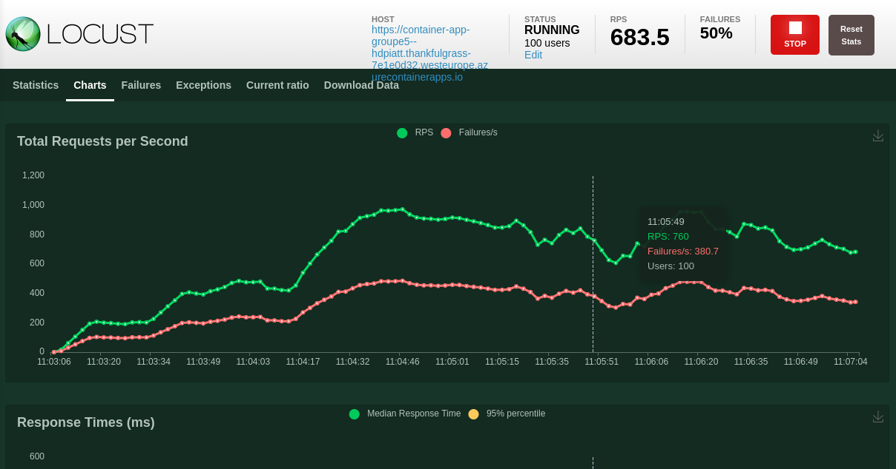

# 🐝 Group 5 : Deploy Flask API with DevOps philosophy 🐝

Lucie Bottin - Céline Khauv - Hadi Jamal Ahmad - Julie Ngan

M2-APP-BDML

## Technologies 
Python, Flask, Docker, Github, Azure, Prometheus, Locust

<h2>Goal : Deploy an iris classifier</h2>

<h3>Overall :</h3> 
<p>- Export our K Nearest Neighbors Classifier model to joblib</p>
<p>- Use the exported model to make an API : /metrics and /predict</p>
<p>- Creation of a docker image with the previous features </p>
<p>- Use GitHub Actions to automatize the deployment of the docker image on an Azure container App</p>
<p>- Load testing with the ACA endpoint</p>

<h2>Deploy an API</h2> 

- Model to get predictions of iris classifications using K Nearest Neighbors
- Attribute Information:

    1. sepal length
    2. sepal width
    3. petal length
    4. petal width

We want the target to be the class of the flower : 

Iris Setosa - Iris Versicolour - Iris Virginica

- Create a Flask API to use the model predictions on real data


<h2>Deploy on docker</h2> 

We used a Dockerfile to build our image and access it on our API

To build the image :

```
docker build . -t iris-docker:0.0.1
```

Then, to run it :
```
docker run -p 5000:5000 -t iris-docker:0.0.1  
```

<h2>Deploy it on the Azure Container Registry (ACR)</h2>

- Create a github workflow with a .yaml file
- Use secrets to put the Azure credentials
- Azure :
  - We could have used Azure Devops, generate our token to access to Azure, but it's already done by our organisation


  
<h2>Deploy it on Azure Container App</h2>

- Auto-scaling
- Endpoint : https://container-app-groupe5--hdpiatt.thankfulgrass-7e1e0d32.westeurope.azurecontainerapps.io/


<h2>Display Metrics on endpoint</h2>

- Prometheus


<h2>Load Test</h2>

- Vegeta for CLI
```
docker run --rm -i peterevans/vegeta sh -c \
```


- K6 for API
```
docker run --rm -i grafana/k6 run - <script.js
```


- Hey : 500 requests for 100 users
```
hey -n 500 -c 100 https://container-app-groupe5--hdpiatt.thankfulgrass-7e1e0d32.westeurope.azurecontainerapps.io
```


- Locust : 100 users
```
locust
```



