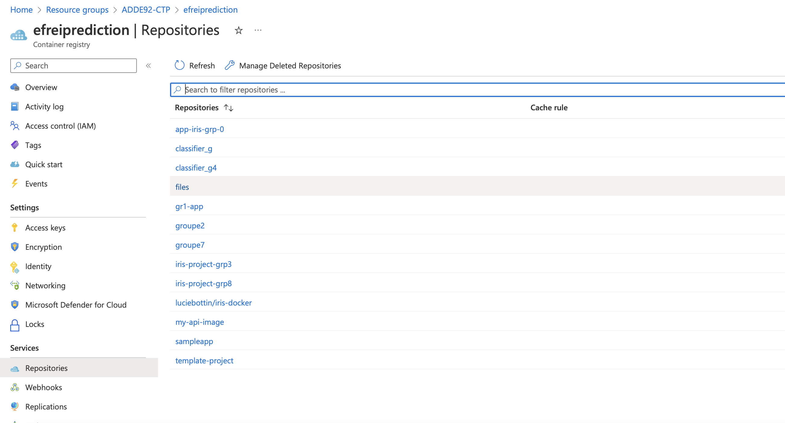
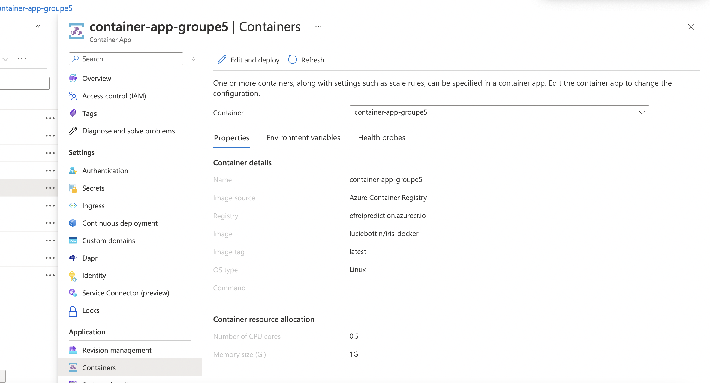
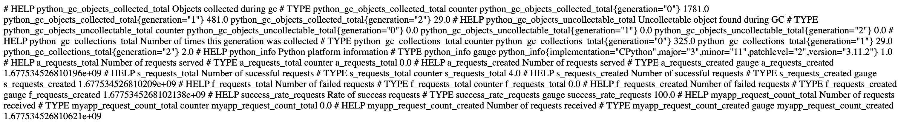
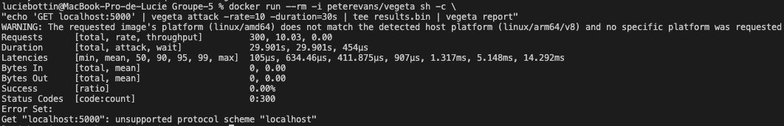
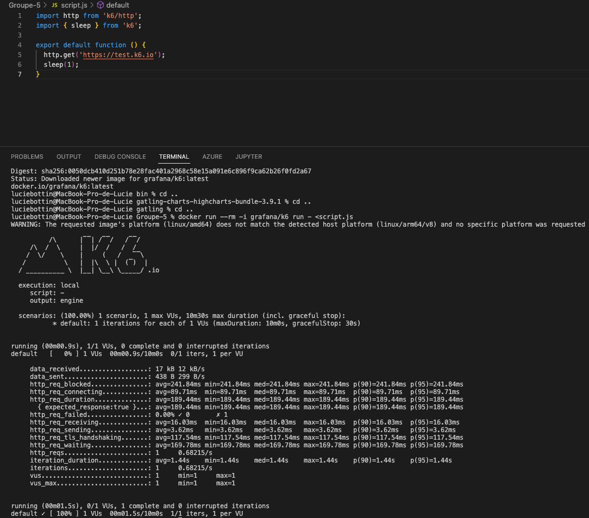
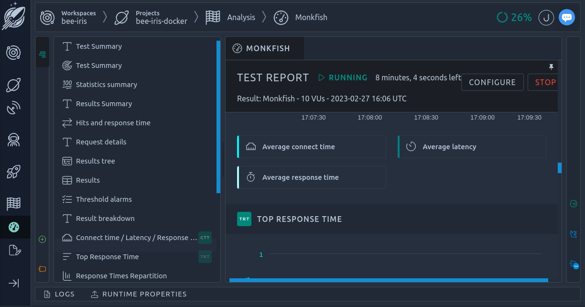
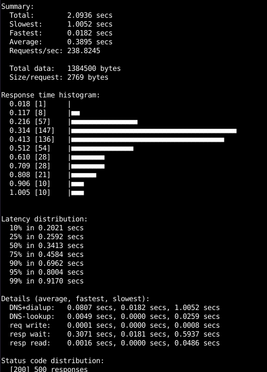

# Group 5 : Deploy Flask API with DevOps philosophy

Lucie Bottin - Céline Khauv - Julie Ngan - Hadi Jamal Ahmad

M2-APP-BDIA

## Technologies 
Python, Flask, Docker, Github, Azure, Prometheus


<h2>Deploy an API</h2> 

- Model to get predictions of iris classifications using K Nearest Neighbors
- Attribute Information:

    1. sepal length
    2. sepal width
    3. petal length
    4. petal width

We want the target to be the class of the flower : 

Iris Setosa - Iris Versicolour - Iris Virginica

- Create a Flask API to use the model predictions on real data


<h2>Deploy on docker</h2>

We used a Dockerfile to build our image and access it on our API

To build the image :

```
docker build . -t iris-docker:0.0.1
```

Then, to run it :
```
docker run -p 5000:5000 -t iris-docker:0.0.1  
```

<h2>Deploy it on the Azure Container Registry (ACR)</h2>

- Create a github workflow with a .yaml file
- Use secrets to put the Azure credentials
- Azure :
  - We could have used Azure Devops, generate our token to access to Azure, but it's already done by our organisation



  
<h2>Deploy it on Azure App</h2>

- Auto-scaling
- Endpoint : https://container-app-groupe5--j367g3w.lemonocean-711ecbc7.westeurope.azurecontainerapps.io



<h2>Display Metrics on endpoint</h2>

- Prometheus



<h2>Load Test</h2>

- Vegeta for CLI



- K6 for API
-> docker run --rm -i grafana/k6 run - <script.js



- Octoperf for SaaS



- Hey : 500 requests for 100 users



